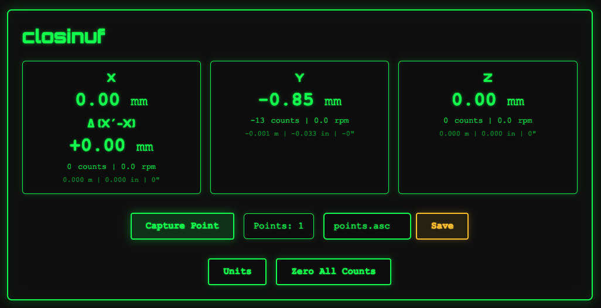

<p align="center">
  
</p>

# closinuf

**3D point scanner** — live 3D coordinates from four quadrature encoders on a Raspberry Pi, with a small web UI, foot‑switch capture, and FreeCAD‑friendly export.

## What it does

- Tracks **X**, **X'**, **Y**, **Z** from dedicated rotary encoders.  
- **Capture Point** in the browser or a **GPIO foot switch** appends the current **(X, Y, Z)** to a list (mm internally).
- **Save** downloads an **ASC** point cloud file, which can be imported into FreeCAD as a point cloud. 
- **Units** cycles mm → m → in → ft. **Zero** clears counts and points.
- **Short beep** on capture when audio output is available (speakers or HDMI).

## Hardware

See [HARDWARE.md](HARDWARE.md).

## Install on the Pi (`install.sh`)

1. On the Pi, clone the repository and enter the project directory:

   ```bash
   git clone https://github.com/scottfeldman/closinuf.git
   cd closinuf
   ```

2. Run the install script as root:

   ```bash
   sudo ./install.sh
   ```

3. Reboot if the installer prompts you to. 

What the script does:

- Enables **SPI** and relocates kernel CE pins off GPIO 8/7 (`dtoverlay=spi0-2cs,cs0_pin=12,cs1_pin=13`) in `/boot/firmware/config.txt`.
- Installs **`alsa-utils`** (`aplay` for capture beep) and **`golang-go`** if `go` is missing.
- Builds **`./closinuf`** in the repo.
- Adds the install user to **`spi`** and **`gpio`** groups (for local `go build` / debugging without the service).
- Installs **closinuf** **systemd** services: **`closinuf.service`** (app on :3000, runs as **root** for `/dev/mem` GPCLK, SPI, and GPIO), **`closinuf-browser.service`** (Chromium as install user)
- Prompts to **reboot** when SPI settings were added to `config.txt` (first install)

Useful commands:

```bash
sudo systemctl status closinuf closinuf-browser
sudo journalctl -u closinuf -f
```

## Manual run (development)

```bash
go build -o closinuf .
sudo ./closinuf
```

Open `http://127.0.0.1:3000`. Root is required for GPCLK setup (`/dev/mem`); the systemd service runs as root for the same reason.

## ASC export

One point per line: `X Y Z` in **millimeters** (space‑separated), suitable for FreeCAD point cloud import.

## Stack

Fiber, HTMX, gomponents, **LS7366R** counters over **SPI0**, **go-gpiocdev** (chip selects + foot switch).

## License

MIT — see [LICENSE](LICENSE).

## Author

Scott Feldman (2026)
